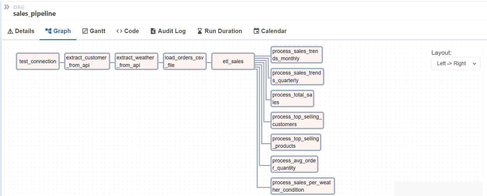
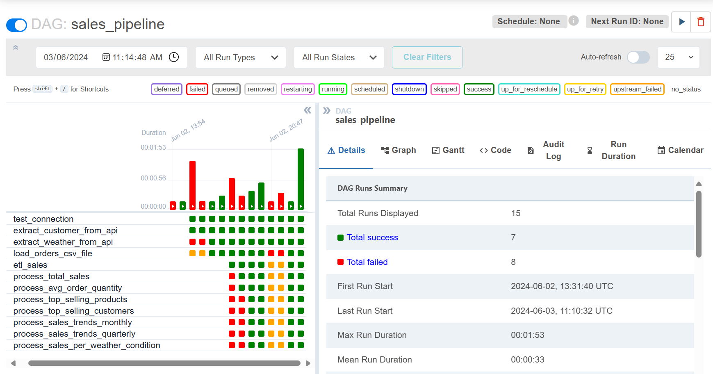
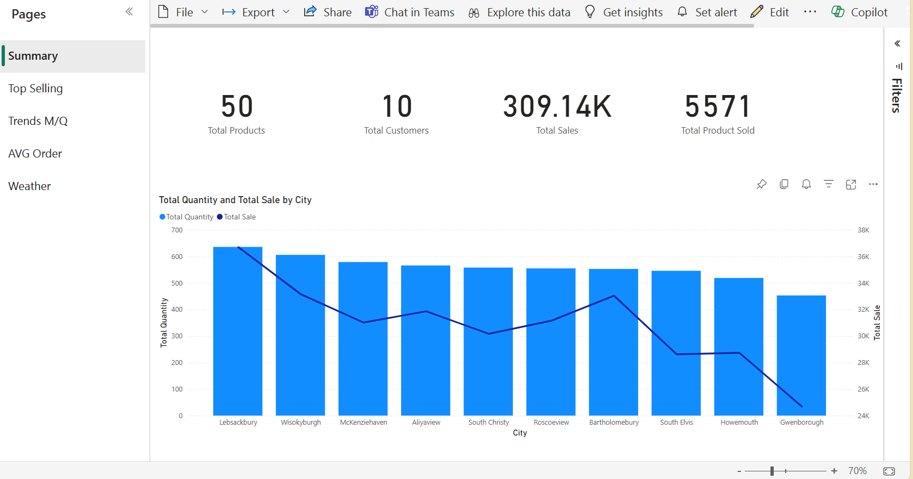
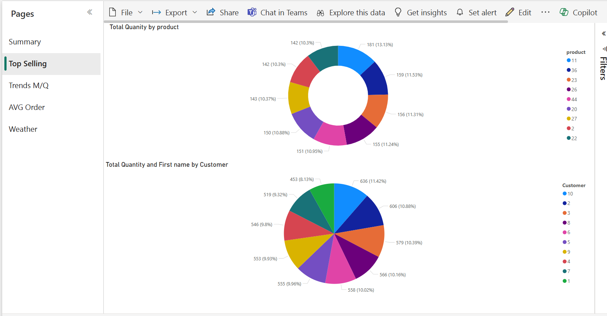
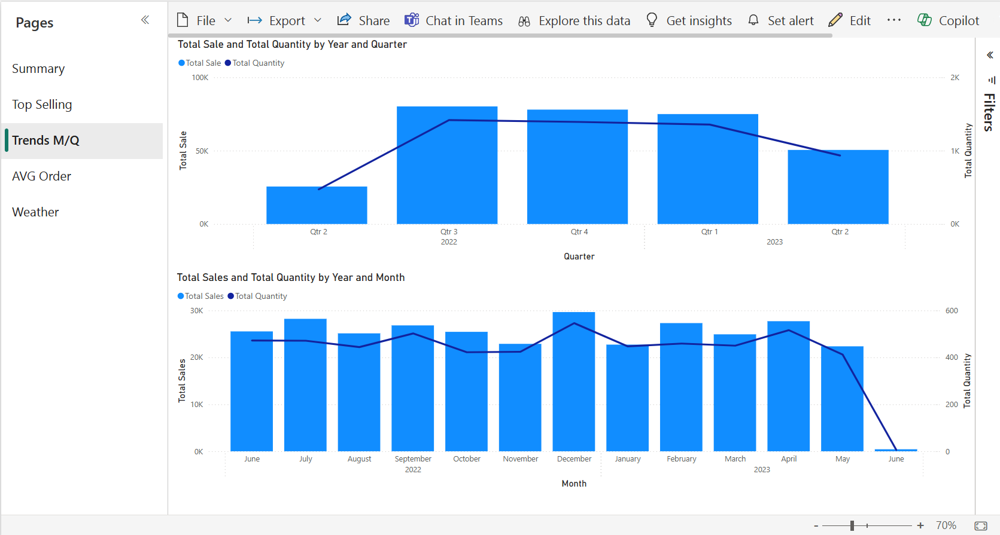
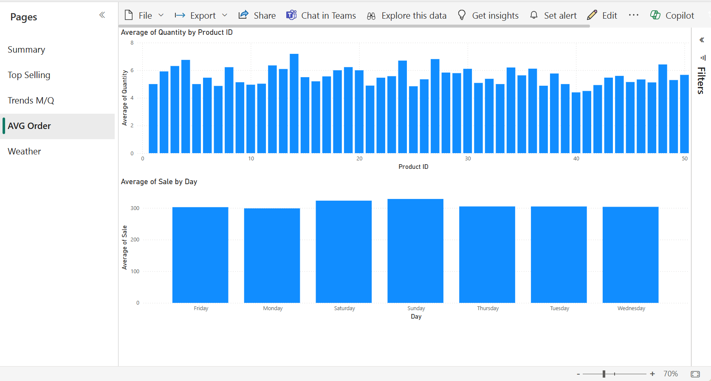
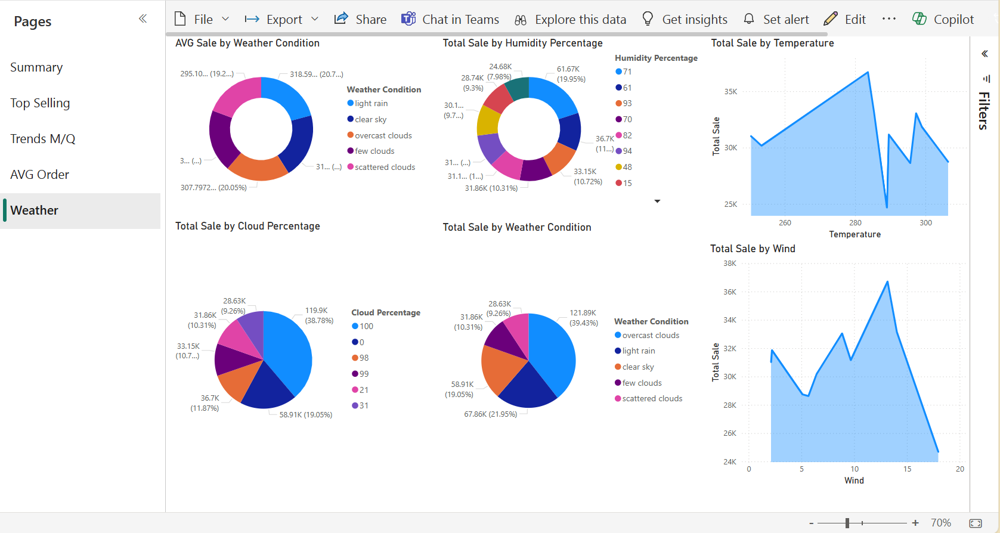
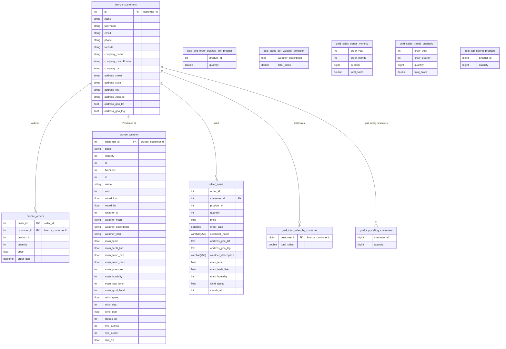

# Sales Pipeline

## Problem Statement

## Data Source

* Customers master data from API
* Orders data from CSV
* Weather data from API

# Tools and Technologies

* Data storage : MySQL
* Data processing : Python Pandas
* Scheduler and workflow management : Apache Airflow
* Data visualization : PowerBI

# Sales Data Pipeline

## Setup environment

prequiresite: WSL/Linux
 
* Clone the repository.
* cp .env.example .env
* docker network create --driver bridge local_network
* docker compose up

## run pipelines
* open localhost:8080/ in browser(username: airflow, password=airflow)
* run pipeline from airflow UI(pipeline name: sales_pipeline)
* it will run the pipeline and load data into database.
## Folder Sturecture

* .env.example
* .gitignore
* docker-compose.yml
* sales_pipelines_db.pbix (powerbi Report file)
* screenshot/ (all screenshot referenced in readme.md file)
* readme.md
* airflow_data/dags/sales_pipeline.py (airflow dag file)
* airflow_data/dags/sales_data.csv (sales data)

## Pipeline snapshot

### pipeline graph

### pipeline detail

## Visualization 
* connection with MySQL database
* open PowerBI report file in PowerBI desktop
* refresh the data

### report snapshot

#### Report Summary
 

#### Report Top Selling
 

#### Report Trends Monthly / Quarterly
 

#### Report AVG Order
 

#### Report based on Weather Conditions

# Logical Schema Model 

